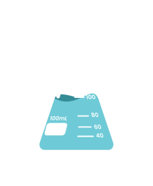

# Projeto Vitalab

## Observação

Para fazer com que o projeto funcione corretamente, tem que seguir alguns passos:

 - **Selecionar o interpretador Python 3.11.4 64hit;**
 - **Instalar o pip install pillow e também o pip install djang caso tenha problemas nas importações;**

## Atualizando o diretório do python em sua máquina:

 - **vai na pasta 'venv', logo em seguida abra o arquivo chamado 'pyvenv.cfg';**
 - **entrando no arquivo você vai ter que atualizar o diretório no arquivo onde está instalado o seu python no seu computador;**
 - **atualize apenas o home, include-system-site-packages, executable e command;**
 - **dependendo da versão do seu python instalado, se for necessário atualize também no próprio arquivo 'pyvenv.cfg';**

**1º Primeiro devemos criar o ambiente virtual:**

## Ativando o 'venv'

### Linux

`source venv/bin/activate`

### Windows

`venv\Scripts\Activate`

## Rodando o servidor para testes:

`python manage.py runserver`

## Como Acessar o Login Vitalab:

- **Login: lucas123**
- **Senha:12345678**
